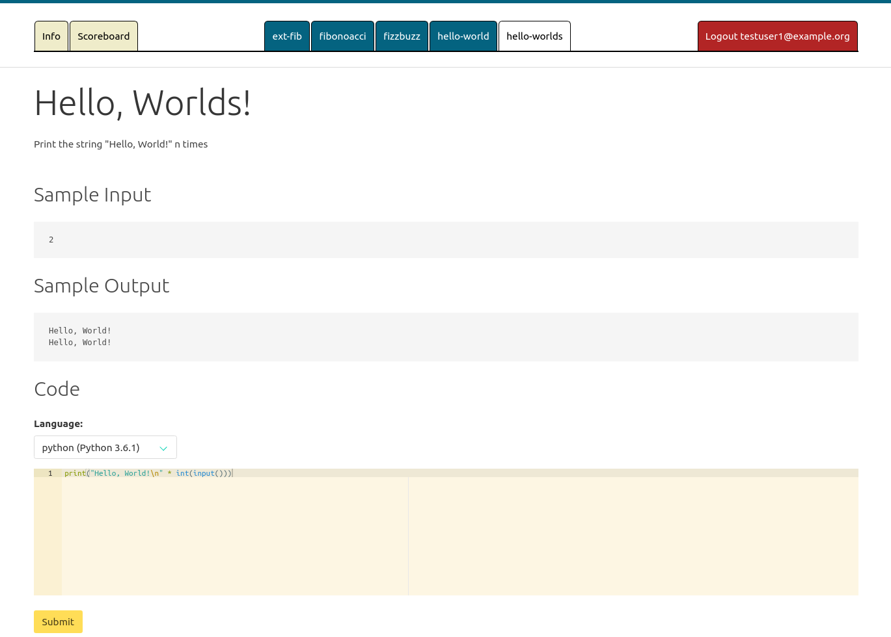

code\_court is a system for running programming competitions.

# Overview
Code\_court is composed of three separate components.
1. __courthouse__ - The backend api server and admin control panel
1. __defendant-frontend__ - The frontend app for contestants
1. __executor__ - The server that runs user submissions

# Docs
- [Dev setup example](https://github.com/unoacm/code_court/blob/master/code_court/docs/developer_setup.md)
- [Production setup docs](https://github.com/unoacm/code_court/blob/master/code_court/docs/production_setup.md)
